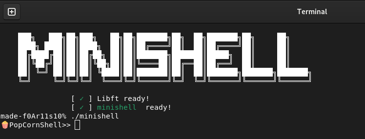

# Minishell

Small shell done in collaboration with [Simon Beylot](https://github.com/bCigueS) (see subject.pdf)





## Usage/Examples

```
make
./minishell
```
- All binary commands supported
- Builtins : echo, cd, pwd, export, unset, env and exit
- Handle pipe and redirections
- Handle ctrl-D, ctrl-C, ctrl-\
- Handle simple and double quote
